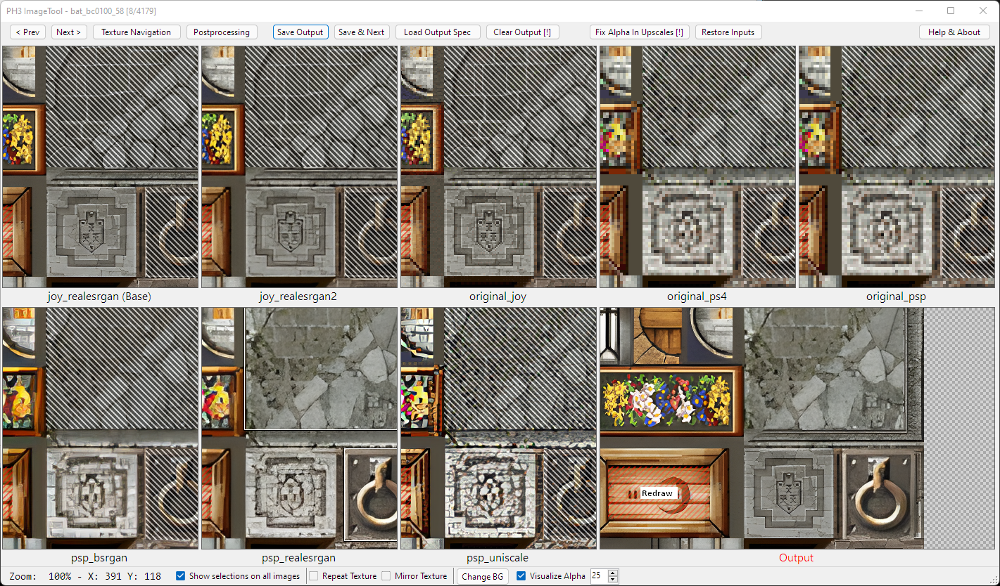
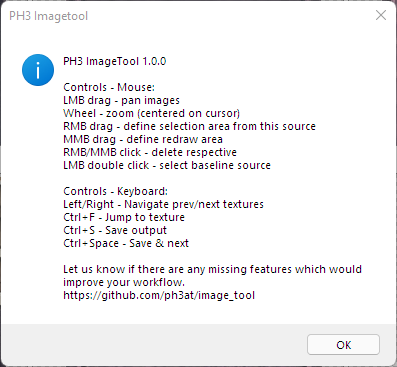
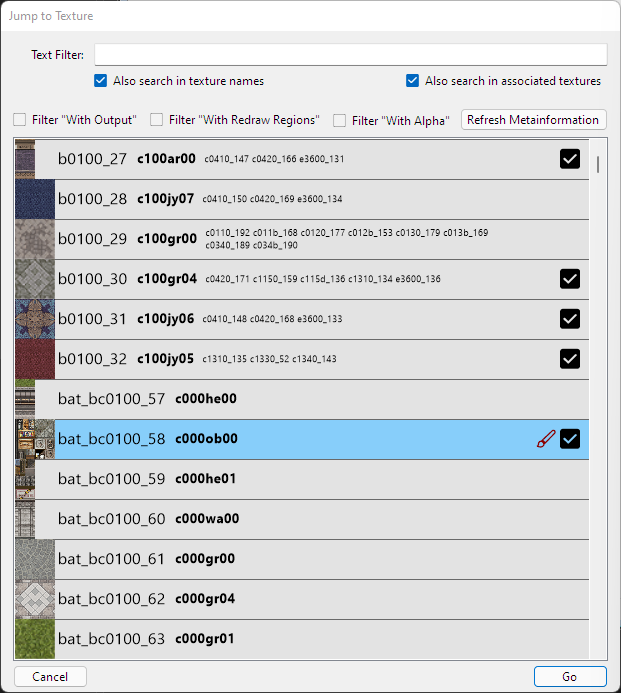

# PH3 ImageTool

PH3 ImageTool is a GUI application which enables quick selection of specific parts of different image versions in a large set of images. This is useful when you e.g. have a large set of textures with various automatic AI upscaling results, and need to select regions from each of them, or mark some regions for manual redrawing.

PH3 ImageTool is **not** an upscaling system. It is designed to speed up the manual selection from previously, independently upscaled textures.



PH3 ImageTool was successfully used on all map textures in the PH3 port of [The Legend of Heroes: Trails from Zero](https://store.steampowered.com/app/1668510/The_Legend_of_Heroes_Trails_from_Zero).


## Features

* **Selection and Processing**
    - Arbitrary number of selctions from arbitrary source images to compose the result
    - Highlighting of redraw regions
    - Alpha channel clamping for alpha tested textures broken by some upscaling scheme

* **View**:
    - Synchronized zoom/panning/etc. across all preview panes.
    - Repeat and Mirroring preview for textures
    - Alpha visualization and different background options

* **Navigation**:
    - Filtering by substrings in texture names and associated textures (e.g. in deduplication)
    - Metainformation filters: with/without (output/redraw regions/alpha)

* **Postprocessing**:
    - Supports calling arbitrary external tools for postprocessing (e.g. conversion to a game-specific format)


## Prerequisites

The expected usage of PH3 imageTool is to serve as a tool to rapidly perform the final *manual* step in an automatic processing chain that e.g. extracts and upscales textures from a game. This processing chain needs to generate the following file structure in order for the GUI to function correctly:

- One folder per image, with a unique name (which serves as the **ID** of this image).
    - Inside this folder, any number of versions of the image can be stored as `.png` files.
    - The output image will be stored as `output.png`
    - Any selection regions etc. will be stored as `output_spec.json`
    - The image `original_psp.png`, if available, will be used as a thumbnail in image navigation. (PRs to make this more flexible/configurable are welcome)
- The following text files with additional information. Each of these needs to have one entry per folder, starting with the image ID, and the entries need to be sorted by ID.
    - `alpha.txt` - a file containing information on whether a given image is transparent. Example:
    ```
    bat_bc0100_74 false
    bat_bc0100_75 true
    bat_bc0200_100 false
    bat_bc0200_101 false
    ...
    ```
    - `assoc.txt` - a file containing additional *associated* IDs for each given ID (or none). This is helpful for the user e.g. in cases of texture deduplication.
    Example (the first two IDs do not have any associated IDs):
    ```
    bat_bc0100_74
    bat_bc0100_75
    bat_bc0200_100 c0200_240
    bat_bc0200_101 obj_c00dor00_22 obj_c00dor01_46
    ```
    - `names.txt` - a file containing a user-facing name for each ID. Unlike IDs, this name does not need to be unique. Example:
    ```
    bat_bc0100_74 c000ob03
    bat_bc0100_75 c000ob01
    bat_bc0200_100 c000wa05
    bat_bc0200_101 c00dor00
    ```

## Usage

The basic mouse usage and shortcuts are listed here:



The basic usage pattern is as follows:

1. Select a baseline source image by double clicking anywhere in its view pane.
2. [optional] Select individual regions from other sources by drawing a rectangle on that source with the right mouse button.
3. [optional] Mark regions for redrawing by drawing on any source or the output with the middle mouse button.
4. [optional] Delete any unwanted regions with left/middle mouse button click.
5. Press Ctrl+Space to move on to the next texture.


### Navigation



The navigation pane allows text-based filtering as well as filtering by various metainformation aspects (output, redraw, alpha). Each filtering option can be clicked *once* in order to filter for only textures *including* that option, and again for *excluding* those matching the option.

In the list view, a cloud icon will be displayed for any non-opaque image, a brush is displayed for any image with redraw regions, and a checkmark is displayed if an output exists. 

## Support

We are happy to add features for a given use case or support you in using this tool for your own project in a sponsorship setup. Please contact imagetool@ph3.at if you are interested.